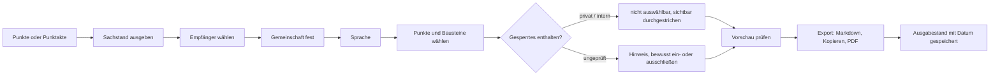

# FLOW-07 · Sachstand gezielt ausgeben

```mermaid
flowchart LR
  A[Punkte oder Punktakte] --> B[Sachstand ausgeben]
  B --> C[Empfänger wählen]
  C --> D[Gemeinschaft fest]
  D --> E[Sprache]
  E --> F[Punkte und Bausteine wählen]
  F --> G{Gesperrtes enthalten?}
  G -- privat / intern --> H[nicht auswählbar, sichtbar durchgestrichen]
  G -- ungeprüft --> I[Hinweis, bewusst ein- oder ausschließen]
  H & I --> J[Vorschau prüfen]
  J --> K[Export: Markdown, Kopieren, PDF]
  K --> L[Ausgabestand mit Datum gespeichert]
```

Kontrollierte Entfernung privater Inhalte (PBI-27) passiert in der Punktakte, nicht in der Ausgabe; das Entfernungsprotokoll wiederholt den Inhalt nicht.
